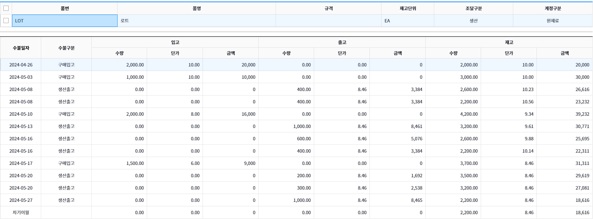
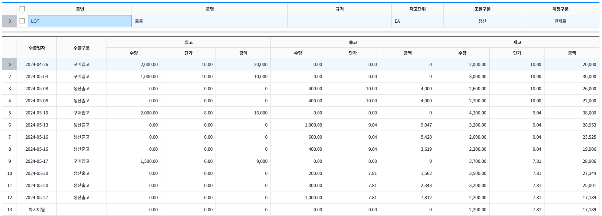
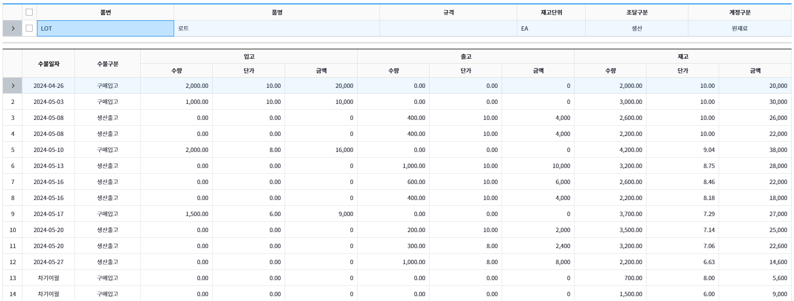

# 재고평가

## 가중평균법 ( 총 평균법 )

총평균법(기말단가기록법)이란 **일정기간 동안의 판매가능상품원가(총매입금액)를 판매가능상품수량(총매입수량)으로 나눈 단가로 매출원가와 기말재고에 배분하는 방법**

- 기말에 가서야 평균단가를 구할 수 있기 때문에 기중에는 상품 판매시마다 단가를 기록할 수 없다. 즉, 마지막에 출고단가를 지정할 수 있다.

### 출고단가

총 평균법의 출고단가는 ( 총매입금액 / 총매입수량 )을 모든 일자에서 고정으로 사용

- 단가 : ( 2,0000 + 10,000 + 16,000 + 9,000 ) / 6,500 = 55,000 / 6,500 = 8.34

### 재고단가

총 평균법의 재고단가는 입/출고시에 따라 { (이전재고금액 - 입/출고금액 ) / ( 이전재고수량 + 입/출고수량 ) }을 사용

- 단가 예시 :
  - 2024-05-08 : (30,000 - 400 \* 8.46) / 2,600 = 10.23
  - 2024-05-08 : (26,616 - 400 \* 8.46) / 2,200 = 10.56

---

## 가중평균법 ( 이동평균법 )

이동평균법(계속단가기록법)은 **구입(입고)이 이루어질 때마다 가중평균단가를 구하고 상품출고 시마다 출고단가를 계속기록하는 방법**

### 출고단가

이동평균법의 출고단가는 이전일자의 재고단가를 사용

### 재고단가

이동평균법의 재고단가는 { ( 이전재고금액 + 입고금액 ) / ( 이전재고수량 + 입고수량 ) }을 입고일자마다 새로 적용

- 단가 예시 :
  - 2024-05-10 : ( 22,000 + 16,000 ) / ( 2,200 + 2,000 ) = 38,000 / 4,200 = 9.04
  - 2024-05-17 : ( 19,906 + 9,000 ) / ( 2,200 + 1,500 ) = 28,906 / 3,700 = 7.81

---

## 선입선출법

선입선출법이란 실제물량의 흐름과는 관계없이 **먼저 취득한 자산이 먼저 판매된 것으로가정하여 매출원가과 기말재고로 구분하는 방법**

- **매출원가는 오래전에 구입한 상품의 원가로 구성, 기말재고는 최근에 구입한 상품의 원가로 구성**

### 출고단가

선입선출법의 출고단가는 선입된 품목에 대한 입고단가를 사용

### 재고단가

선입선출법의 재고단가는 입/출고시에 따라 { (이전재고금액 - 입/출고금액 ) / ( 이전재고수량 + 입/출고수량 ) }을 사용

- 2024-05-10 : ( 22,00 + 16,000 ) / (2,200 + 2,000) = 38,000 / 4,200 = 9.04

---

## 후입선출법

선입선출법이란 선입선출법과 반대로 **실제물량의 흐름과는 관계없이 후에 취득한 자산이 먼저 판매된 것으로가정하여 매출원가과 기말재고로 구분하는 방법**

---

## 추가정보

- 기초 : 전월기말재고를 반영(재고평가 등록된 전월기말재고)
- 입/출고 : 계정구분에 맞게 정상적인 입/출고를 나타냄
- 대체입/출고 : 계정구분에 맞지않은 입/출고를 나타냄
  - 대체입고 대상 : 생산입고(제품,반제품 제외), 구매입고(원/부재료,저장품,상품 제외) , 생산출고(제품,반제품 제외), 영업출고(제품/상품 제외)
- 재고 : 기초 + 입고(대체포함) - 출고(대체포함) = 기말재고
