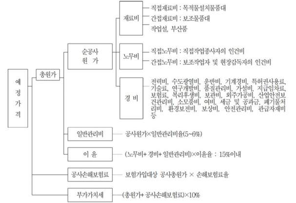

# 원가 요소

## 재료비

재료비는 제조원가를 구성하는 다음 내용의 직접재료비, 간접재료비로 한다.

재료비 = 재료량 × 단위당가격

- **직접재료비는 계약목적물의 실체를 형성하는 물품의 가치를 말함**
  - 제조를 위해 직접 소비되는 물품 ex) 원재료(플라스틱, 철근) 등
- **간접재료비는 계약목적물의 실체를 형성하지는 않으나 제조에 보조적으로 소비되는 물품의 가치**
  - 제조에 간접적으로 소비되는 물품 ex) 부재료(본드, 접착제) 등

## 노무비

노무비는 제조원가를 구성하는 다음 내용의 직접노무비, 간접노무비를 말한다.

노무비 = 노무량 × 단위당가격

- **직접노무비는 제조현장에서 계약목적물을 완성하기 위하여 직접작업에 종사하는 종업원 및 노무자에 의하여 제공되는 노동력의 대가**로서 기본급,제수당,상여금,퇴직급여충당금의 합계액
- **간접노무비는 직접 제조작업에 종사하지는 않으나, 작업현장에서 보조작업에 종사하는 노무자, 종업원과 현장감독자에 의하여 제공되는 노동력의 대가** 기본급과 제수당,상여금,퇴직급여충당금의 합계액
  - 아마란스는 노무비에 대해 직/간접을 나누어 다루지 않음

## 경비

경비 = 소요(소비)량 × 단위당가격

- 경비는 제품의 제조를 위하여 소비된 제조원가중 재료비, 노무비를 제외한 원가를 말하며 기업의 유지를 위한 관리활동부문에서 발생하는 일반관리비와 구분
